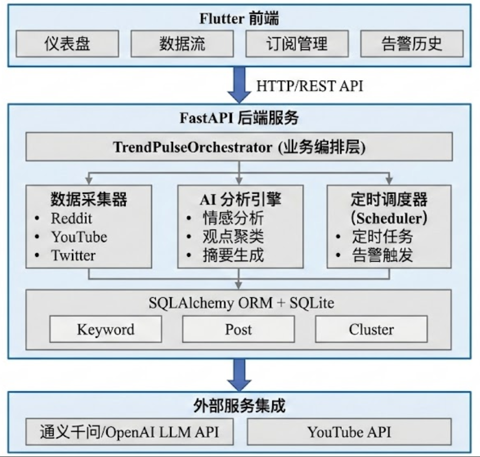

# TrendPulse 舆情脉冲

<div align="center">

**一款全栈社交媒体情感分析应用**

基于 AI 的多平台舆情监测与分析系统

[](https://www.python.org/)
[](https://flutter.dev/)
[](https://fastapi.tiangolo.com/)
[](LICENSE)

</div>

---

## 📖 项目简介

TrendPulse 舆情脉冲是一款全栈社交媒体情感分析应用，能够从 Reddit、YouTube 和 X/Twitter 等平台自动采集数据，并通过 AI 技术进行情感分析、观点聚类和摘要生成，最终在 Flutter 仪表盘中可视化展示分析结果。

### ✨ 核心功能

- **🌍 多平台数据采集**
  - Reddit 帖子和评论（使用 Selenium 爬虫）
  - YouTube 视频元数据和字幕（使用 YouTube Data API v3）
  - X/Twitter 推文（使用 Selenium 爬虫）

- **🤖 AI 智能分析**
  - 情感评分（0-100 分制）
  - 观点聚类（自动提取 3 个主要讨论点）
  - 内容摘要（生成人类可读的综述）
  - 基于 LangChain 的 Map-Reduce 长文本处理

- **📊 数据可视化**
  - Flutter 仪表盘展示
  - 情感趋势图表
  - 观点聚类卡片
  - Mermaid 思维导图

- **⏰ 定时监控**
  - 关键词订阅功能
  - 定时自动分析（可配置间隔）
  - 负面情感预警（情感分低于阈值时触发）
  - 告警历史记录

---

## 🏗️ 系统架构



### 架构特点

- **事件驱动架构**：基于 asyncio/aiohttp 的异步 I/O 处理
- **分层设计**：数据采集 → AI 分析 → 数据存储 → API 服务 → 前端展示
- **模块化组件**：各采集器独立，易于扩展新平台
- **异步处理**：全链路异步，支持高并发采集和分析

---

## 🛠️ 技术栈

### 后端 (Python)

| 组件 | 技术选型 | 用途 |
|------|---------|------|
| **Web 框架** | FastAPI 0.109+ | REST API 服务 |
| **异步运行时** | asyncio/aiohttp | 并发处理 |
| **数据采集** | Selenium 4.15+ | Reddit/Twitter 爬虫 |
| | youtube-transcript-api | YouTube 字幕 |
| | webdriver-manager | ChromeDriver 自动管理 |
| **数据库** | SQLAlchemy 2.0+ | ORM |
| | aiosqlite 0.19+ | 异步 SQLite |
| **AI/LLM** | LangChain 0.1+ | LLM 编排 |
| | OpenAI SDK 1.10+ | OpenAI API |
| | 通义千问 API | 中文分析优化 |
| **任务调度** | APScheduler 3.10+ | 定时任务 |
| **测试** | pytest 7.4+ | 单元测试 |

### 前端 (Flutter)

| 组件 | 技术选型 | 用途 |
|------|---------|------|
| **框架** | Flutter 3.x | 跨平台 UI |
| **状态管理** | Provider 6.1+ | 状态管理 |
| **图表** | fl_chart 0.65+ | 数据可视化 |
| **网络** | http 1.1+ | API 请求 |
| **本地存储** | shared_preferences 2.2+ | 持久化配置 |
| **WebView** | webview_flutter 4.4+ | Mermaid 图表渲染 |

---

## 🚀 快速开始

### 前置要求

- **Python**: 3.13 或更高版本
- **Flutter**: 3.x SDK
- **Chrome/Chromium**: 浏览器（用于 Selenium）
- **API 密钥**:
  - 通义千问 API 或 OpenAI API（二选一）
  - YouTube Data API v3 密钥（可选，用于 YouTube 采集）

### 后端设置

#### 1. 克隆项目

```bash
git clone https://github.com/CliPg/trend-pulse.git
cd trend-pulse/backend
```

#### 2. 创建虚拟环境

```bash
python -m venv venv
source venv/bin/activate  # Windows: venv\Scripts\activate
```

#### 3. 安装依赖

```bash
pip install -r requirements.txt
```

#### 4. 配置环境变量

创建 `.env` 文件：

```bash
# LLM 配置（选择一个提供商）
LLM_PROVIDER=openai  # 或 tongyi

# OpenAI 配置
OPENAI_API_KEY=sk-your-openai-api-key
OPENAI_MODEL=gpt-4o-mini
OPENAI_BASE_URL=https://api.openai.com/v1

# 通义千问配置（推荐用于中文分析）
TONGYI_API_KEY=sk-your-tongyi-api-key
TONGYI_MODEL=qwen3-max
TONGYI_BASE_URL=https://dashscope.aliyuncs.com/compatible-mode/v1

# YouTube API（可选）
YOUTUBE_API_KEY=your-youtube-api-key
```

#### 5. 初始化数据库

```bash
python -c "from src.database.operations import DatabaseManager; from src.config import Config; import asyncio; db = DatabaseManager(Config.DATABASE_URL); asyncio.run(db.init_db())"
```

#### 6. 启动 API 服务

```bash
python -m src.api.main
```

服务将在 `http://localhost:8000` 启动

- **API 文档（Swagger）**: http://localhost:8000/docs
- **API 文档（ReDoc）**: http://localhost:8000/redoc

### 前端设置

#### 1. 进入前端目录

```bash
cd frontend
```

#### 2. 安装依赖

```bash
flutter pub get
```

#### 3. 运行应用

```bash
flutter run
```

或指定平台：

```bash
# macOS
flutter run -d macos

# iOS
flutter run -d ios

# Android
flutter run -d android

# Web
flutter run -d chrome
```

---

## 📡 API 文档

### 基础信息

- **Base URL**: `http://localhost:8000`
- **Content-Type**: `application/json`
- **响应格式**: JSON

### 核心接口

#### 1. 分析关键词

**接口**: `POST /analyze`

**描述**: 对指定关键词进行社交媒体情感分析

**请求参数**:

```json
{
  "keyword": "DeepSeek",
  "language": "en",
  "platforms": ["reddit", "youtube", "twitter"],
  "limit_per_platform": 20
}
```

| 参数 | 类型 | 必填 | 默认值 | 说明 |
|------|------|------|--------|------|
| keyword | string | 是 | - | 要分析的关键词 |
| language | string | 否 | "en" | 语言代码：en/zh |
| platforms | array | 否 | ["reddit", "youtube", "twitter"] | 采集平台列表 |
| limit_per_platform | int | 否 | 20 | 每个平台最多采集数 |

**响应示例**:

```json
{
  "keyword": "DeepSeek",
  "keyword_id": 1,
  "status": "success",
  "posts_count": 45,
  "platforms": ["reddit", "youtube"],
  "overall_sentiment": 72.5,
  "sentiment_label": "positive",
  "summary": "用户普遍对 DeepSeek 的编程能力感到兴奋...",
  "opinion_clusters": [
    {
      "label": "代码质量",
      "summary": "用户赞扬代码生成能力",
      "mention_count": 18
    },
    {
      "label": "性能表现",
      "summary": "讨论速度和效率",
      "mention_count": 15
    }
  ],
  "mermaid": {
    "mindmap": "mindmap\n  root((DeepSeek))\n    代码质量\n    性能表现",
    "pie_chart": "pie title DeepSeek 观点分布\n  \"代码质量\" : 18\n  \"性能表现\" : 15",
    "flowchart": "flowchart TD\n  A[DeepSeek] --> B[用户评论1]"
  },
  "posts": [
    {
      "platform": "reddit",
      "author": "user123",
      "content": "DeepSeek 太棒了！",
      "url": "https://reddit.com/...",
      "sentiment_score": 85.0,
      "sentiment_label": "positive",
      "upvotes": 150
    }
  ]
}
```

**注意**: 此操作可能需要 30-60 秒，取决于平台数量和数据量。

---

#### 2. 获取所有关键词列表

**接口**: `GET /keywords`

**描述**: 获取数据库中所有分析过的关键词

**响应示例**:

```json
{
  "keywords": [
    {
      "id": 1,
      "keyword": "DeepSeek",
      "language": "en",
      "overall_sentiment": 72.5,
      "last_analyzed": "2026-01-17T10:30:00"
    },
    {
      "id": 2,
      "keyword": "ChatGPT",
      "language": "en",
      "overall_sentiment": 68.2,
      "last_analyzed": "2026-01-16T15:45:00"
    }
  ]
}
```

---

#### 3. 获取关键词详情

**接口**: `GET /keywords/{keyword_id}`

**描述**: 获取指定关键词的详细分析结果

**路径参数**:
- `keyword_id` (int): 关键词 ID

**响应示例**:

```json
{
  "id": 1,
  "keyword": "DeepSeek",
  "language": "en",
  "overall_sentiment": 72.5,
  "summary": "用户普遍对 DeepSeek 的编程能力感到兴奋...",
  "last_analyzed": "2026-01-17T10:30:00",
  "posts_count": 45,
  "opinion_clusters": [...],
  "posts": [...]
}
```

---

#### 4. 创建订阅

**接口**: `POST /subscriptions`

**描述**: 创建关键词定时监控订阅

**请求参数**:

```json
{
  "keyword": "iPhone 16",
  "platforms": ["reddit", "youtube"],
  "language": "en",
  "post_limit": 50,
  "alert_threshold": 30.0,
  "interval_hours": 6,
  "user_email": "user@example.com"
}
```

**响应示例**:

```json
{
  "id": 1,
  "keyword": "iPhone 16",
  "keyword_id": 3,
  "platforms": "reddit,youtube",
  "language": "en",
  "post_limit": 50,
  "alert_threshold": 30.0,
  "interval_hours": 6,
  "is_active": true,
  "created_at": "2026-01-17T10:00:00",
  "last_checked_at": null,
  "next_check_at": "2026-01-17T16:00:00",
  "user_email": "user@example.com"
}
```

---

#### 5. 获取订阅列表

**接口**: `GET /subscriptions`

**描述**: 获取所有活跃订阅

**响应示例**:

```json
[
  {
    "id": 1,
    "keyword": "iPhone 16",
    "keyword_id": 3,
    "platforms": "reddit,youtube",
    "language": "en",
    "post_limit": 50,
    "alert_threshold": 30.0,
    "interval_hours": 6,
    "is_active": true,
    "created_at": "2026-01-17T10:00:00",
    "last_checked_at": "2026-01-17T16:00:00",
    "next_check_at": "2026-01-17T22:00:00",
    "user_email": "user@example.com"
  }
]
```

---

#### 6. 更新订阅

**接口**: `PUT /subscriptions/{subscription_id}`

**描述**: 更新订阅配置

**路径参数**:
- `subscription_id` (int): 订阅 ID

**请求参数**: 同创建订阅

---

#### 7. 取消订阅

**接口**: `DELETE /subscriptions/{subscription_id}`

**描述**: 停用订阅（软删除）

**路径参数**:
- `subscription_id` (int): 订阅 ID

**响应示例**:

```json
{
  "message": "Subscription cancelled successfully"
}
```

---

#### 8. 获取告警历史

**接口**: `GET /alerts`

**描述**: 获取情感告警历史记录

**查询参数**:
- `limit` (int): 返回数量，默认 50
- `acknowledged` (bool): 筛选已确认状态

**响应示例**:

```json
[
  {
    "id": 1,
    "subscription_id": 1,
    "keyword": "iPhone 16",
    "sentiment_score": 25.5,
    "sentiment_label": "negative",
    "posts_count": 50,
    "negative_posts_count": 35,
    "summary": "检测到大量负面评价...",
    "is_sent": true,
    "created_at": "2026-01-17T12:00:00",
    "acknowledged_at": null
  }
]
```

---

#### 9. 确认告警

**接口**: `PATCH /alerts/{alert_id}/acknowledge`

**描述**: 标记告警为已确认

**路径参数**:
- `alert_id` (int): 告警 ID

---

### 健康检查接口

#### `GET /` 或 `GET /health`

**响应**:

```json
{
  "status": "ok"
}
```

---


## 📁 项目结构

```
trend-pulse/
├── backend/                       # Python 后端
│   ├── src/
│   │   ├── collectors/           # 数据采集器
│   │   │   ├── base.py          # 基础采集器类
│   │   │   ├── reddit.py        # Reddit 采集器
│   │   │   ├── youtube.py       # YouTube 采集器
│   │   │   └── twitter.py       # Twitter 采集器
│   │   ├── ai_analysis/          # AI 分析引擎
│   │   │   ├── prompts/         # Prompt 模板
│   │   │   │   ├── sentiment_prompts.py
│   │   │   │   ├── clustering_prompts.py
│   │   │   │   └── summarization_prompts.py
│   │   │   ├── utils/           # 工具模块
│   │   │   │   ├── token_counter.py
│   │   │   │   ├── map_reduce.py
│   │   │   │   └── logger.py
│   │   │   ├── client.py        # LLM 客户端
│   │   │   ├── sentiment.py     # 情感分析
│   │   │   ├── clustering.py    # 观点聚类
│   │   │   ├── summarizer.py    # 摘要生成
│   │   │   └── pipeline.py      # 分析管道
│   │   ├── database/             # 数据库层
│   │   │   ├── models.py        # SQLAlchemy 模型
│   │   │   └── operations.py    # 数据库操作
│   │   ├── api/                  # API 层
│   │   │   └── main.py          # FastAPI 应用
│   │   ├── config.py             # 配置管理
│   │   ├── orchestrator.py       # 业务编排
│   │   ├── scheduler.py          # 定时调度
│   │   └── utils/                # 工具函数
│   ├── tests/                    # 测试文件
│   ├── scripts/                  # 调试脚本
│   ├── logs/                     # 日志文件
│   ├── requirements.txt          # Python 依赖
│   └── pytest.ini                # pytest 配置
│
├── frontend/                     # Flutter 前端
│   ├── lib/
│   │   ├── screens/             # 页面
│   │   │   ├── dashboard_screen.dart
│   │   │   └── subscriptions_screen.dart
│   │   ├── widgets/             # 组件
│   │   │   ├── sentiment_gauge.dart
│   │   │   ├── opinion_card.dart
│   │   │   ├── post_list.dart
│   │   │   └── mermaid_viewer.dart
│   │   ├── services/            # 服务
│   │   │   ├── api_service.dart
│   │   │   └── mock_data.dart
│   │   └── main.dart            # 应用入口
│   └── pubspec.yaml             # Flutter 依赖
│
├── docs/                        # 技术文档
│   ├── AI_ANALYSIS.md           # AI 分析文档
│   ├── DATABASE_DESIGN.md       # 数据库设计
│   ├── PROXY_CONFIG.md          # 代理配置
│   └── UI_DESIGN.md             # UI 设计
│
├── CLAUDE.md                    # Claude Code 指引
└── README.md                    # 本文档
```

---

## 🧪 测试

### 后端测试

```bash
cd backend

# 运行所有测试
pytest tests/ -v

# 运行特定测试
pytest tests/test_sentiment.py -v

# 查看覆盖率
pytest tests/ --cov=src --cov-report=html
```

```

---

## 🎯 创新点

1. **Map-Reduce 长文本处理**: 自动分批处理，优化 Token 使用
2. **定时监控订阅**: 无需手动触发，自动定期分析
3. **负面情感预警**: 情感分低于阈值时自动告警
4. **Mermaid 可视化**: 思维导图、饼图、流程图多种展示
5. **Few-shot Prompt**: 8 个精心设计的示例提升分析准确性
6. **跨平台前端**: Flutter 支持 macOS/iOS/Android/Web

---


## 📄 许可证

MIT License


---

## 📞 联系方式

如有问题或建议，欢迎提 Issue 或 Pull Request！

---

<div align="center">

**Built with ❤️ for TrendPulse Challenge 2026**

</div>
